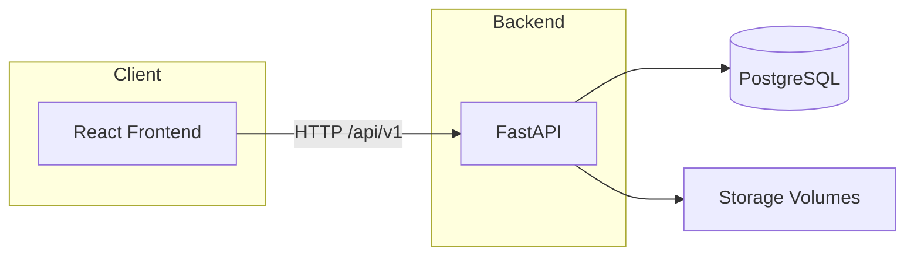

# Architektur

## Überblick

Die Pipeline ist eine **Full-Stack-Anwendung**: Das Frontend spricht per HTTP mit der API; die API persistiert Daten in **PostgreSQL** und lagert generierte Artefakte im **Dateisystem** (`storage/`).



## Verzeichnisstruktur (Kurzform)

```
├── api/                    # FastAPI-Backend
│   ├── app/
│   │   ├── main.py         # App, CORS, Static-Mounts, Router /api/v1
│   │   ├── database.py     # SQLAlchemy 2.x async
│   │   ├── core/           # Config, Security, Rate-Limit
│   │   ├── config/         # Storage-Pfade
│   │   ├── models/         # ORM
│   │   ├── routers/        # Endpunkte
│   │   ├── schemas/        # Pydantic v2
│   │   ├── services/       # Orchestrierung, image/mesh/bgremoval providers
│   │   └── providers/      # Animation, Rigging
│   └── alembic/            # Migrationen
├── frontend/               # React, TypeScript, Vite
│   └── src/
│       ├── api/            # Axios, VITE_API_URL
│       ├── components/
│       ├── pages/
│       └── store/          # PipelineStore
├── storage/                # Persistente Daten (Docker-Volumes / .gitignore)
│   ├── meshes/
│   ├── bgremoval/
│   ├── assets/
│   ├── animations/
│   └── rembg_cache/
└── docker-compose.yml      # db, api, frontend; optional blender (profile tools)
```

## API-Version und Authentifizierung

Geschäftslogik-Endpunkte hängen unter **`/api/v1`**. Zugriff kann per **API-Key** (`Authorization: Bearer …`) abgesichert sein, wenn `API_KEY` gesetzt ist — siehe [Konfiguration](configuration.md).

Statische Auslieferung generierter Dateien erfolgt über Mounts wie `/static/meshes`, `/static/images` usw. (siehe `api/app/main.py`).

## Tech-Stack

| Schicht | Technologien |
|---------|----------------|
| Backend | Python 3.12, FastAPI, SQLAlchemy 2.x (async), Alembic, Pydantic v2 |
| Frontend | React 19, TypeScript, Vite, TanStack Query, Three.js |
| Datenbank | PostgreSQL 16 |
| Infra | Docker, Docker Compose |
